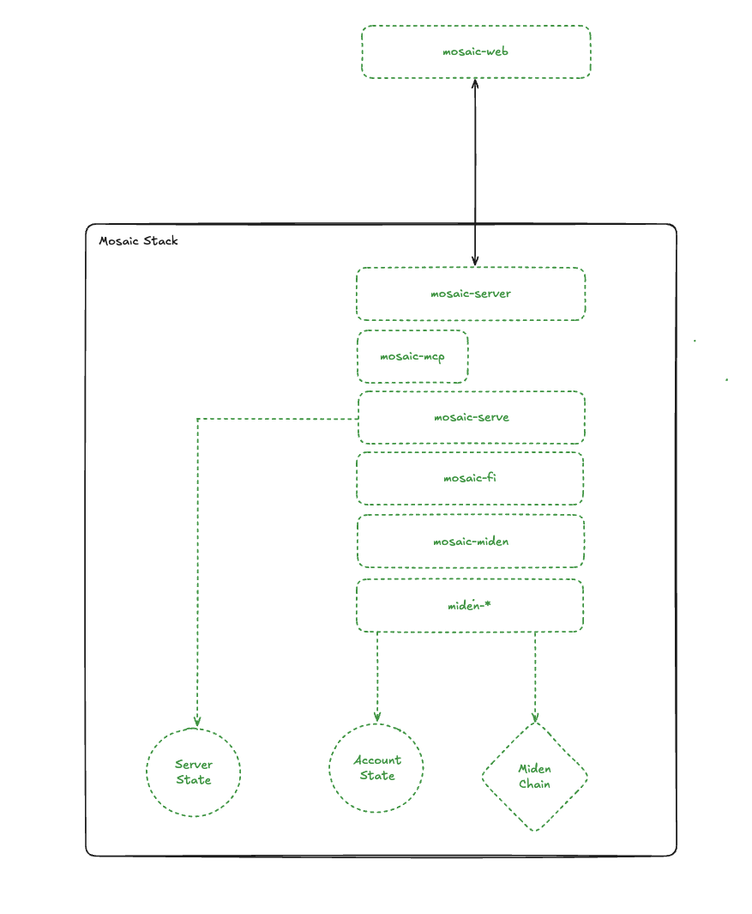

# Mosaic

A privacy-preserving over-the-counter (OTC) trading platform built on the Miden protocol.

🔴 Under heavy development, expect dragons! 🔴

## Overview

Mosaic enables trustless OTC trading while maintaining participant privacy through Miden's zero-knowledge proof system. The platform combines private participant identities with public price discovery and private settlement.

## Key Features

* **Privacy-First Trading** - Client and liquidity provider identities remain private using [Miden private notes](https://0xmiden.github.io/miden-docs/imported/miden-base/src/note.html)
* **Transparent Price Discovery** - Public order book and transaction history ensure fair pricing
* **Zero-Knowledge Settlements** - Trades execute without revealing participant information
* **Non-Custodial** - Users maintain full control of their assets throughout the trading process

## Architecture

The Mosaic stack is designed for local deployment, ensuring private state remains secure and under user control.

| Component | Description |
|-----------|-------------|
| `mosaic-web` | Next.js frontend application |
| `mosaic-server` | Backend server executable |
| `mosaic-serve` | Persistence layer for clients, accounts, and notes |
| `mosaic-mcp` | Experimental Model Context Protocol (MCP) server |
| `mosaic-fi` | Financial primitives and trading logic implementation |
| `mosaic-miden` | Core abstractions and types for Miden protocol integration |
